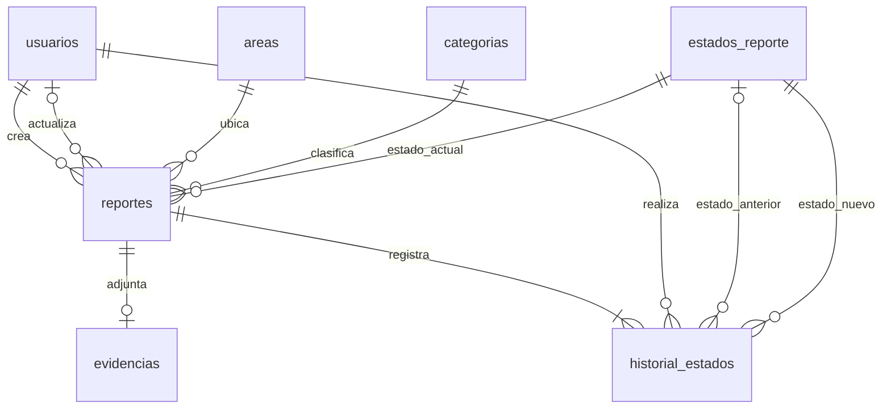

# Modelo de datos y reportes de NexoU

Fecha: 5 de octubre de 2026. Objetivo: MySQL 8.0.16 o superior, InnoDB y `utf8mb4`.

La definición parte de `src/types/index.ts`, `src/constants/catalog.ts`, los repositorios y las pantallas actuales. Cubre F01–F08, las estadísticas F09 y los avisos F10. La app todavía guarda datos en AsyncStorage: estos archivos definen la base para una API futura; no conectan React Native a MySQL.

## Archivos y ejecución

1. Ejecutar [01_esquema.sql](../database/mysql/01_esquema.sql) una vez en una base nueva.
2. Ejecutar [02_catalogos.sql](../database/mysql/02_catalogos.sql). Puede repetirse sin duplicar catálogos.
3. Ajustar las variables de [03_reportes.sql](../database/mysql/03_reportes.sql) y ejecutar las consultas necesarias.
4. Opcional: ejecutar [04_validacion.sql](../database/mysql/04_validacion.sql) en una base de desarrollo para comprobar integridad y cambios de estado.

En MySQL Workbench: abrir cada archivo y ejecutar el script completo, en ese orden. En el cliente `mysql`, usar `SOURCE C:/ruta/NexoU/database/mysql/01_esquema.sql;` y repetir para los demás archivos. `DELIMITER` es una instrucción del cliente; un migrador debe enviar cada trigger completo como una sola sentencia.

El esquema crea `nexou` y no contiene `DROP DATABASE`, borrados de tablas ni cuentas reales. No es una migración reejecutable: si ya existen tablas con esos nombres se detiene; usar una base nueva o preparar una migración explícita. No ejecutar con opciones que ignoren errores. La creación de tablas tiene commits implícitos; un error puede dejar el esquema parcialmente creado.

## Entidades y diccionario

| Tabla | Datos principales | Relaciones y reglas |
|---|---|---|
| `usuarios` | ID, nombre, matrícula/código, correo, hash y algoritmo de contraseña, rol, activo, fechas | Correo y matrícula únicos; roles `estudiante` / `personal`. Baja lógica con `activo`. |
| `areas` | ID, nombre, orden, activo | Nueve áreas iguales al catálogo del formulario. Desactivar impide nuevos reportes allí y conserva los existentes. |
| `categorias` | ID, nombre, orden, activo | Mobiliario, Electricidad, Agua, Limpieza, Equipos y Otros. |
| `estados_reporte` | Código, nombre, orden | Solo `pendiente`, `revision`, `solucionado`. |
| `reportes` | ID, número, estudiante, título, descripción, área, categoría, estado, actor y fechas | Título de hasta 80 caracteres; descripción de hasta 500. Inicia pendiente. |
| `evidencias` | ID, reporte, clave de archivo, MIME, bytes, fecha | Cero o una foto por reporte, como en la interfaz actual. JPEG, PNG o WebP. |
| `historial_estados` | ID, reporte, estado anterior/nuevo, actor, fecha | Registra creación y cada cambio efectivo de estado. El estado anterior es NULL solo en la creación. |

Los IDs de usuarios y reportes son `VARCHAR(40)` con comparación binaria ASCII para admitir los IDs `u_…` / `r_…` actuales o UUID de texto. Los catálogos usan `SMALLINT UNSIGNED`; los números de reporte, evidencia e historial usan `BIGINT UNSIGNED`. Fechas: `DATETIME(3)` en UTC; no almacenar fechas locales sin convertirlas.

`reportes.numero` es único y autoincremental. La vista genera el folio `NX-<numero>`; puede haber huecos por transacciones canceladas. Sustituye al folio calculado por `folioDe`, que reduce el ID a cuatro dígitos y puede colisionar. El ID sigue siendo la identidad del reporte.

No se repite `ownerNombre` en `reportes`: se obtiene por JOIN con `usuarios`; refleja el nombre actual. Los hashes de contraseña no aparecen en las vistas de reportes.

## Reglas del flujo

- Solo un estudiante activo crea reportes; el área y categoría deben estar activas.
- Solo personal activo cambia el estado. Se permiten cambios entre cualquiera de los tres estados, incluida reapertura, de acuerdo con F08 y la pantalla actual.
- Cambiar a `solucionado` fija `solucionado_en`. Reabrir lo limpia. Cerrar nuevamente registra la nueva fecha y conserva los cierres anteriores en el historial.
- Asignar el mismo estado no modifica fechas ni agrega un evento.
- El estado, sus fechas y su historial cambian en la misma transacción mediante triggers. La primera versión no admite editar autor, título, descripción, área o categoría después de publicar.
- Las claves foráneas restringen eliminaciones para conservar trazabilidad. Usuarios y catálogos se desactivan. La cuenta SQL de la API debe tener solo SELECT sobre el historial; sus escrituras las ejecutan los triggers con los permisos de su definidor.
- La matrícula/código único es una regla nueva respecto al almacenamiento local, que solo verifica el correo. Antes de importar, revisar duplicados.

Los triggers verifican el rol del ID recibido; no identifican por sí solos al usuario de la app. La API debe autenticar la sesión y tomar de ella `usuario_id` y `actualizado_por`. Un estudiante no debe poder proporcionar el ID de otro usuario o registrarse como personal. Las cuentas de personal se provisionan por un mecanismo autorizado.

## Reportes e indicadores

`v_reportes_detalle` combina incidencia, estudiante, catálogos y evidencia sin multiplicar filas. `v_avisos_personal` reproduce los avisos existentes: un elemento por reporte según su estado actual. No implica notificaciones push, seguimiento de lectura o un centro de mensajes.

| ID | Salida | Filtro y uso |
|---|---|---|
| R01 | Mis reportes con folio, estado y evidencia | Estudiante de la sesión; estado opcional; 50 filas iniciales. |
| R02 | Listado general del personal | Creación en período, área, categoría y estado opcionales. Base para exportar detalle. |
| R03 | Total, pendientes, en revisión, solucionados y porcentaje solucionado | Reportes creados en período, clasificados por estado actual. |
| R04 | Cantidad por categoría | Incluye categorías con cero incidencias; alimenta barras. |
| R05 | Áreas con más incidencias y categoría predominante | Período por creación; desempate determinista por ID. Primera fila = área más reportada. |
| R06 | Cantidad diaria | Fecha local; incluye días sin incidencias; alimenta línea de tendencia. |
| R07 | Reportes abiertos y horas de antigüedad | Todos los pendientes/en revisión; más antiguos primero. No presupone un SLA. |
| R08 | Tiempo promedio hasta la última solución | Solo reportes actualmente solucionados, creados en período. Sin datos devuelve promedio NULL. |
| R09 | Historial de una incidencia | Fecha, actor y estados. Propietario o personal autorizado. |
| R10 | Avisos del personal | Todos, avisos de pendientes o cambios de estado; más recientes primero. |

Los períodos usan un límite inferior inclusivo y uno superior exclusivo: `creado_en >= desde AND creado_en < hasta`. Esto evita perder fracciones de segundo o contar dos veces la medianoche. El ejemplo usa octubre de 2026 con desplazamiento `-06:00`; en la API, calcular los límites según `America/Mexico_City` u otra zona configurada y enviar UTC. Para períodos históricos con cambios de horario, usar una biblioteca de zonas o las tablas de zonas de MySQL, no asumir siempre un desplazamiento fijo.

La pantalla actual usa últimos 7 días, últimos 30 días o el último año, no necesariamente semana/mes/año calendario. La API debe generar esos mismos límites. Para la línea actual, solicitar los últimos 7 días completos incluyendo hoy. R06 admite hasta 366 días completos; validar este máximo y que `desde < hasta` antes de consultar.

R03 y R04 indican el estado actual de una cohorte creada en el período: no son una fotografía del estado al cierre de un mes ni el número de soluciones realizadas dentro de ese mes. R08 mide horas transcurridas desde creación hasta el último cierre, incluyendo períodos entre reaperturas; no mide horas de trabajo del personal. Estas métricas requieren historial real; no inferir un cierre desde `updatedAt` de datos antiguos.

Los listados usan `LIMIT 50` como primera página. La API debe agregar paginación por `(creado_en, id)` y validar el tamaño. Para exportación, recorrer las páginas con el mismo orden; no tratar las primeras 50 filas como un reporte completo. La autorización se aplica tanto a pantalla como a descarga.

## Integración y migración

React Native → API HTTPS → MySQL. La API usa consultas preparadas, valida entradas y mantiene las credenciales de base de datos en el servidor. Las vistas no filtran automáticamente por usuario: R01 y la consulta individual requieren el filtro de sesión; R02–R08 y R10 requieren rol personal.

| Campo actual | Destino |
|---|---|
| `User.id`, `nombre`, `matricula`, `email`, `rol`, `createdAt` | `usuarios.id`, `nombre`, `matricula`, `email`, `rol`, `creado_en` |
| `passwordHash` | `password_hash` + algoritmo `sha256_legacy` para importación; actualizar al reautenticar o restablecer contraseña |
| `Report.id`, `ownerId`, `titulo`, `descripcion` | `reportes.id`, `usuario_id`, `titulo`, `descripcion` |
| `ownerNombre` | `v_reportes_detalle.usuario_nombre` |
| `area`, `categoria` | Resolver por nombre contra catálogos y guardar IDs |
| `estado`, `createdAt`, `updatedAt` | `estado_codigo`, `creado_en`, `actualizado_en` |
| `photoBase64` | Subir archivo, guardar `evidencias.archivo_clave` y generar URL desde la API |
| Folio de `folioDe(id)` | `v_reportes_detalle.folio` |

Guardar nuevas contraseñas como hashes producidos por la biblioteca de autenticación de la API, con algoritmo y parámetros identificables. La app actual utiliza SHA-256 con sal derivada del correo; conservarlo solo para compatibilidad temporal. No calcular hashes ni comparar contraseñas mediante SQL. La sesión local no se importa como sesión de servidor: la API necesita su propio mecanismo de autenticación.

La clave de evidencia identifica un archivo almacenado en servidor o almacenamiento de objetos. No guardar una URL firmada que caduca ni una URI local del dispositivo. La API comprueba contenido, tamaño máximo y permisos al subir/descargar; la base solo restringe los metadatos indicados. Si falla el alta, la API limpia la subida que haya quedado sin referencia.

El esquema es para altas nuevas. Importar reportes locales requiere una migración específica: los triggers normales obligan a iniciar pendiente y no permiten reescribir fechas ni fabricar historial anterior. Conservar las fechas disponibles, distinguir historial desconocido y no inventar quién solucionó un reporte. Revisar IDs, matrículas, catálogos y folios antes de esa migración.

No se incluyen GPS, chat, comentarios, asignación automática a técnicos, inventarios ni presupuestos.

## Referencias técnicas

- [MySQL: restricciones CHECK](https://dev.mysql.com/doc/refman/8.4/en/create-table-check-constraints.html).
- [MySQL: creación de triggers](https://dev.mysql.com/doc/refman/8.4/en/create-trigger.html).
- [MySQL: creación de vistas](https://dev.mysql.com/doc/refman/8.4/en/create-view.html).

## Verificación

La validación ejecutable comprueba alta e historial inicial, cambios y reapertura, repetición sin eventos extra, unicidad, restricciones, referencias y roles. Los datos de prueba se revierten al finalizar; las rutinas auxiliares se eliminan. Usar exclusivamente una base de desarrollo.

Se ejecutaron los cuatro archivos sin errores en una instancia temporal aislada de MariaDB 10.4.32 (XAMPP), con modo estricto y `ONLY_FULL_GROUP_BY`. Pasaron las comprobaciones de integridad, roles, historial, reapertura y vistas. También se comprobaron los indicadores sin datos: conteos cero, categorías sin incidencias, días sin reportes y promedio NULL.

Una segunda ejecución con incidencias de prueba comprobó límites inclusivos/exclusivos, agrupación por día local al cruzar medianoche UTC, categorías, área predominante y porcentaje de solución. También se repitió la carga de catálogos (9 áreas, 6 categorías y 3 estados) sin duplicados y se verificó que el rollback dejó cero usuarios, reportes e historial de prueba.

El equipo no tiene un servidor MySQL disponible para esta verificación. MariaDB permite comprobar estas sentencias compartidas, pero no sustituye ejecutar los archivos en el MySQL de destino; esa comprobación sigue pendiente antes de integrar la API.
